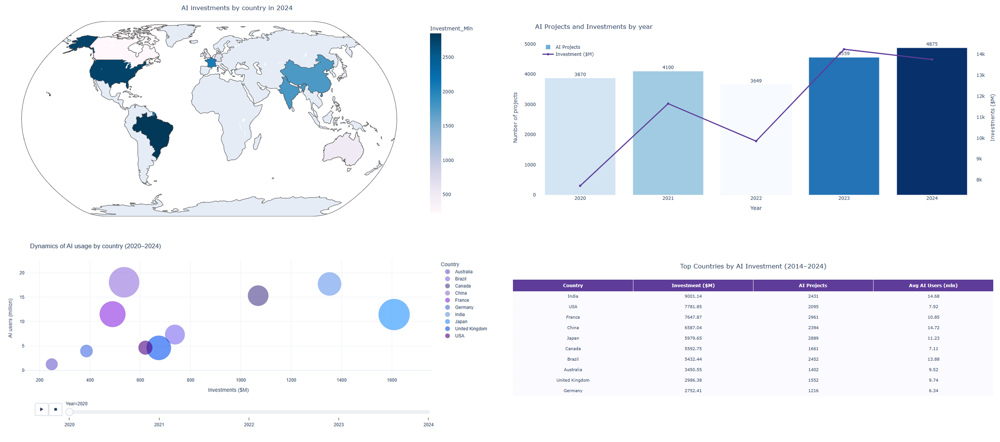

# 💡 Free Interactive Dashboard with Voila

**📄 Опис проєкту (UA)**: Цей проєкт демонструє, як за допомогою Python, Plotly та Voila можна **повністю безкоштовно створити інтерактивний сайт із дашбордом**, який відкривається за одним посиланням і не потребує хостингу чи платних платформ.

**📄 Project Description (EN)**: This project showcases how to build your **own interactive data dashboard website using Python — 100% free**, powered by Plotly and Voila. The dashboard launches directly from GitHub via MyBinder — no hosting or deployment needed.

📊 **Type:** Interactive dashboard  
📁 **Data:** Synthetic dataset (`ai_adoption.csv`)  
🛠 **Tools:** Python, Plotly, pandas, Voila

## 📊 Основні візуалізації:

- 🗺️ AI investment map by country  
- 📈 Combined bar + line chart (projects & investments)  
- 🔵 Animated bubble chart by year  
- 📋 Top countries table with key metrics  

---
### 🖼️ Preview of the Dashboard




---
🎥 **📺 Відеоогляд на YouTube/ Video overview YouTube**: https://youtu.be/JOOWjMu2cTw


---
<h3>🚀 Запусти дашборд онлайн</h3>

<a href="https://mybinder.org/v2/gh/IrynaSenchenko/ai-dashboard-voila/main?urlpath=voila/render/ai_dashboard.ipynb" target="_blank">
  
</a>

<p><strong>🔗натисни на кнопку вище, щоб відкрити інтерактивний AI-дашборд / click the button above to open the interactive AI dashboard </strong></p>

---

### 📁 Repository structure
```
ai-dashboard-voila/
├── ai_dashboard.ipynb      # Main dashboard notebook
├── ai_adoption.csv         # Synthetic dataset
├── requirements.txt        # Dependencies
├── README.md               # This file
├── .gitignore              # Ignore system/cache files
```

---

### 🧪 How to run locally:
```bash
pip install -r requirements.txt
voila ai_dashboard.ipynb
```

---

👩‍💻 **Author:** Iryna Senchenko  
🔗 [LinkedIn profile](https://www.linkedin.com/in/iryna-senchenko/)